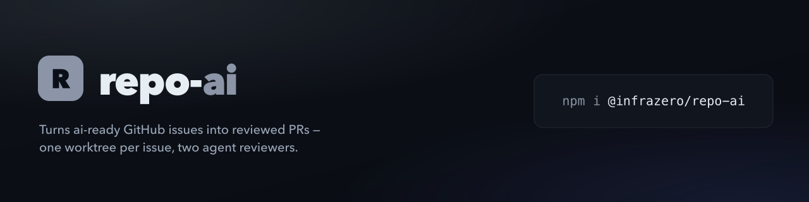

<picture>
  <source media="(max-width: 640px)" srcset="./brand/banner-mobile.png">
  
</picture>

# @infrazero/repo-ai

The **ai-loop** pipeline: a label-driven loop that takes an `ai-ready` GitHub issue, implements it in its own git worktree, opens a PR, has two agents review it, and hands it to a human to merge.

issue → loop → PR → two reviews → you merge → [you release](https://docs.infrazero.dev/repo-ai/docs/getting-started#8-merging-and-releasing).

This package holds the moving parts: the Claude Code skills, the `loop` commands they call, and a `doctor`/`fix` pair for the loop's setup. It was split out of [`@rtorcato/repo-tooling`](https://github.com/rtorcato/repo-tooling) so the tooling can be used without the loop.

New here? [Getting started](https://docs.infrazero.dev/repo-ai/docs/getting-started) is the one-page walkthrough from zero to a first handed-over PR. See [the docs site](https://docs.infrazero.dev/repo-ai/docs/ai-loop) for how the pipeline works.

## Requirements

repo-ai targets **Claude Code** only for now; other agent harnesses aren't supported yet. What each part depends on:

| Part | Depends on |
|---|---|
| `repo-ai` CLI (`loop …`, `doctor`, `fix`, `setup`) | Node ≥ 22 and `gh`. Harness-neutral, so any agent or script can call it |
| Skills (`ai-loop`, `ai-issue`, `ai-loop-status`, `ai-loop-stop`) | The Claude Code skill format |
| Parallel implement/review (`ai-loop` Pass 3 and Pass 4, via the `ai-loop-recover` and `ai-loop-pickup` workflows) | The **Workflow** tool. Named reviewer types (`code-reviewer`, `security-expert`) need them in the Agent tool's registry; otherwise the reviewers run as `general-purpose`. Without Workflow, `ai-loop` falls back to background Agent calls |
| Self-scheduling (`/ai-loop` keeps itself going) | A session-scoped recurring **CronCreate** job |
| Wake on change (`loop watch`) | The **Monitor** tool |
| Statusline segment | Claude Code's statusline JSON |

Workflow runs show in `/workflows`. If you edit the scripts in `workflows/`, load `/workflow-authoring` first.

## Set up

```bash
npx @infrazero/repo-ai setup
```

> **⚠️ Costs and liability.** By installing or using repo-ai, you accept these risks and responsibilities. repo-ai runs AI agents unattended, and they spend your Anthropic credits or plan limits and your GitHub Actions minutes. The loop's limits are best-effort, not a spending guarantee. Set spend limits with your provider, and stop the loop when you aren't watching it. Agents can be wrong, so you review and merge every change. Provided as is under the MIT license, with no warranty; the authors aren't liable for costs, damages or changes made by agents. Not affiliated with Anthropic or GitHub. Read the full [Risks and responsibilities](https://docs.infrazero.dev/repo-ai/docs/risks).

`setup` shows this notice first and asks `Continue? (y/N)`, once per machine (recorded in `~/.config/repo-ai/acknowledged`) and again if the text changes; `--yes` or `--json` counts as acceptance.

One guided run: the skills, the loop labels, the agent identity, and the statusline segment, asking before each, then `doctor`. Then `/ai-issue`, `/ai-loop`, and when a PR is `merge-ready`, you merge and [you release](https://docs.infrazero.dev/repo-ai/docs/getting-started#8-merging-and-releasing). The skill step installs `ai-loop`, `ai-issue`, `ai-loop-status` and `ai-loop-stop` into `~/.claude/skills` (or `--skills-dir <path>`).

### Installing the skills

Two ways, pick one:

- **Claude Code plugin.** In Claude Code, run `/plugin marketplace add infra-zero/repo-ai`, then `/plugin install repo-ai@repo-ai`. The plugin ships the three skills. It is **unversioned**: it has no `version` field and follows `main`, so every update to `main` reaches plugin users with no release step.
- **`npx @infrazero/repo-ai fix claude-skills`** (also run by `setup`). Copies the skills into `~/.claude/skills`, stamped with the npm version you ran, and installs the Workflow scripts (`workflows/*.js`) into `~/.claude/workflows`.

The plugin carries the skills only. Pass 3 and Pass 4 run their Workflow scripts by name, so plugin users still need those scripts from `fix claude-skills`; without them `ai-loop` falls back to background Agent calls. Either way the skills call the CLI through `npx @infrazero/repo-ai`.

**Moving over from repo-tooling?** Skills installed by `@rtorcato/repo-tooling` carry that package's version stamp, so this installer treats them as local edits and won't overwrite them. Run it once with `--force-skills`.

## Commands

| Command | What it does |
|---|---|
| `setup [--yes] [--json]` | Onboard a repo: runs `fix config`, `fix claude-skills`, creates or repairs the loop labels, `fix ai-loop-identity` (with an agent user), and `fix statusline` — asking before each — then `doctor`. |
| `doctor [--json]` | Audit the loop setup: the loop labels against their spec; `.repo-ai.json` present and valid against its schema; `agentUser` matches the `gh` identity; `humanUser` set on an organisation-owned repo; `autoMerge` only with a release gate; **CI runs** — default-branch push runs cancelled or pending with no jobs, or a `ciWorkflow` that does not exist; **Release approval** — a `release` run waiting on approval for over a day; **Release run** — the newest completed default-branch run whose `release` job failed. Both read `release.yml`'s runs (any event) when the repo has one, else the CI workflow's push runs; **Security alerts** — open Dependabot alerts, high/critical named and moderate/low folded into the count, silent on 403/404; installed skills, plugin skills and workflows, and whether they are current; `requiredSkills` installed; the Claude Code `permissions.allow` rules a tick needs; with Claude Code's sandbox on, `gh *` and `npx @infrazero/repo-ai *` in `sandbox.excludedCommands`; and whether your statusline shows the loop status. `requiredSkills`, permissions and the sandbox are checked only when `agentUser` is set. All read-only. Exits 1 only on `drift` / `missing`. |
| `fix config` | Write `$schema`, and every unset key that has a default, into `.repo-ai.json`. With no file, create one, migrating any old `.repo-tooling.json` settings once. |
| `fix labels` | Repair loop label colours and descriptions with `gh label edit`. |
| `fix claude-skills` | Install or update the skills, and the Workflow scripts they run by name (`workflows/*.js` → `~/.claude/workflows`). `--force-skills` overwrites a modified or newer copy. |
| `fix ai-loop-identity` | Deprecated (#285): point this checkout's Claude sessions at a `gh` profile signed in as `agentUser`. Prefer a per-session `GH_TOKEN`. |
| `fix sandbox` | With Claude Code's sandbox on, add `gh *` and `npx @infrazero/repo-ai *` to `sandbox.excludedCommands` in the settings file that turns it on. An allow rule only skips the prompt; a sandboxed `gh` fails TLS on macOS (no keychain) and `npx` can't write its cache, so a tick halts or needs an unsandboxed retry the auto-mode classifier may refuse. Excluding `gh *` gives `gh` your keychain and network, which the loop needs anyway to label PRs. Never sets `enabled`, never creates a `sandbox` block, and writes nothing while the sandbox is off. Chained calls (`cd x && gh …`) still run sandboxed. |
| `fix statusline` | Install the loop's status segment (`🤖 2 agents·1 to merge · next 9m`) to `~/.claude/ai-loop-statusline.sh`, replacing that file on every run (it is ours; don't edit it). Never touches an existing statusline: sets `statusLine` in `~/.claude/settings.json` only when you have none, otherwise prints the one line to add to your own script. Never prompts. |
| `loop guard` | Repair a wrongly-bare main checkout, gate the `node_modules` rebuild, and assert the agent identity. |
| `loop env` | Print a tick's values (root, worktree root, owner/repo, agent and human users) for a human; the skill reads them from `loop tick --json`. |
| `loop worktree add <slug>` | Create an `ai-*` worktree off `origin/main` and link its dependencies. |
| `loop cleanup` | Remove `ai-*` worktrees whose PR has landed or closed. |
| `loop apply` | Apply a tick's deterministic writes: Pass 1's disarm, handoff, send-back, `merge-ready` strip and branch update; Pass 2's worktree removal (then the `node_modules` rebuild gate), `ai-wip` relabel and the label side of each stall. Its only merge is an `autoMerge` handoff. Reports every edit, and in `comments` each comment the caller still owes. |
| `loop reap` | Report agents stalled past 45 minutes and what to do about each. |
| `loop comment <pr>` / `loop verdict <pr>` | Upsert the decision comment, and read a reviewer's verdict marker. |
| `loop tick` | Compute one tick's whole work list (guard, cleanup, reap, verdicts, pickups). `.skippedPickups[]` names each `ai-ready` issue it passed over and why (an untrusted author, or a file an `ai-wip` issue also names); `.dependabotRecreate` lists the red or `DIRTY` Dependabot PRs in the loop that `loop apply` asks to `@dependabot recreate`. Read-only: writes no GitHub state and removes no worktree — `loop apply` does that. |
| `loop watch` | Poll `loop tick`'s work list every `pollSeconds` and print a line only when it changes: `HH:MM  <summary>  review #78 · pickup #39 …`. An `agentUser` mismatch warns on stderr instead of halting. Runs until killed. |
| `loop tier <pr>` | Choose the review tier from the PR's changed paths: `both` (docs-only — one combined reviewer) or `split` (`code` + `sec`). Fails closed to `split`. |

Every command takes `--json`. Configuration lives in the repo's `.repo-ai.json` (`agentUser`, `requiredSkills`). `doctor` reports it missing; `fix config` creates it.

## License

MIT
