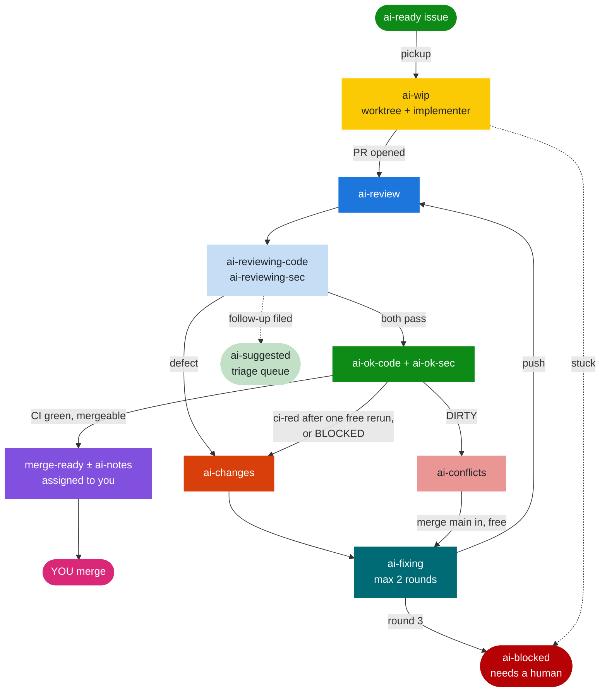

import Link from '@docusaurus/Link'
import LabelChips, { Labels } from '@site/src/components/LabelChips'

`ai-loop` is a **label-driven pipeline** that takes a GitHub issue marked
`ai-ready`, implements it in a per-issue git worktree, opens a PR, has two agents
review it, and hands it to you to merge. It runs unattended on a timer.

`repo-ai` ships the skill and its `loop` commands. The repo-side pieces it
relies on — the branch-protection standard and the `.claude/settings.json`
worktree config — come from [`@rtorcato/repo-tooling`](https://github.com/rtorcato/repo-tooling).

:::warning

**Costs and liability.** By installing or using repo-ai, you accept these risks and responsibilities. repo-ai runs AI agents unattended, and they spend your Anthropic credits or plan limits and your GitHub Actions minutes. The loop's limits are best-effort, not a spending guarantee. Set spend limits with your provider, and stop the loop when you aren't watching it. Agents can be wrong, so you review and merge every change. Provided as is under the MIT license, with no warranty; the authors aren't liable for costs, damages or changes made by agents. Not affiliated with Anthropic or GitHub. Read the full [Risks and responsibilities](./risks.md).

:::

## Install it

```bash
npx @rtorcato/repo-ai fix claude-skills
```

That writes `~/.claude/skills/ai-loop/SKILL.md`. Unlike every other fixer
this one writes **user-global** state — a directory shared by every project on
the machine — which is why it is **opt-in**: a bare `fix` or `fix --yes` skips
it and says so, and `doctor` reports it as *not configured* rather than as a
finding against your repo.

Four things follow from that:

- **`--skills-dir <path>`** overrides the destination. It is required alongside
  `--yes` / `--json` when `~/.claude/skills` does not exist, since a prompt
  would corrupt the JSON payload.
- **A stow-managed symlink is written *through*, not replaced.** If
  `~/.claude/skills/ai-loop/SKILL.md` is a symlink into a dotfiles
  checkout, the content lands in dotfiles and stays version-controlled with the
  rest of your Claude config. The CLI reports the resolved real path so you know
  what to commit.
- **The install refuses to downgrade.** Each installed copy carries a
  `repo-ai-version` stamp in its frontmatter. A repo pinned to an older
  release reports and skips rather than overwriting a newer skill — otherwise
  two repos on different versions would fight over it on every `fix`.
- **The install refuses to overwrite a local fork.** Alongside the version, each
  copy carries a `repo-ai-hash` of the content we wrote. If the installed
  file no longer matches that hash — or predates it, so nothing can be proven —
  the install prints what diverged and stops, the same rule
  [`fix copied-assets`](https://docs.torcato.dev/repo-tooling/docs/guides/cli) follows for copied presets. This is the case
  the version stamp alone cannot see: a fork that is merely *older* than the
  package looks exactly like a stale copy. Diff it against the shipped file the
  message names, then pass **`--force-skills`** to take the shipped version.
  `--yes` deliberately does *not* imply it: unattended runs pass `--yes`, and
  this is the one overwrite that destroys work living outside the repo.

Any agent that reads the [`skills`](https://www.npmjs.com/package/skills) CLI
format can also take it straight from GitHub:

```bash
npx skills add https://github.com/rtorcato/repo-ai --skill ai-loop
```

## Configuration

Per-repo settings live in `.repo-ai.json` at the repo root. Every key is
optional:

```json
{
  "$schema": "https://docs.torcato.dev/repo-ai/repo-ai.json",
  "agentUser": "my-bot",
  "requiredSkills": ["ai-loop"]
}
```

| Key | Type | Default | Read by |
|---|---|---|---|
| `$schema` | string | none | Your editor, for completion and validation. `fix config` and `setup` write it. |
| `agentUser` | string | none: the loop runs as whoever `gh` is signed in as | `loop guard`, which halts a tick running as anyone else; `loop tick`'s `.env`; `fix ai-loop-identity`; `doctor`. |
| `humanUser` | string | the repo owner's login, when it is a user; empty on an organisation-owned repo | `loop tick`'s `.env.humanUser`, which the skill assigns merge-ready PRs, `ai-blocked` issues and declined issues to. `doctor` warns when an organisation-owned repo leaves it unset. |
| `requiredSkills` | string[] | `[]`: no check | `doctor`, which reports any listed skill that is not installed. Checked only when `agentUser` is set. |
| `pollSeconds` | integer | `180`; values below `60` are raised to `60` | `loop watch`, between polls. Each poll costs several GitHub API calls against the 5,000/h limit. |
| `budgetTokens` | integer | `400000`; values below `1000` are ignored | `loop tick`'s `.env.budgetTokens`, passed to the `ai-loop-pickup` and `ai-loop-recover` Workflow scripts, which enforce it — an agent past the cap is skipped and `log()`ged, not spawned. It bounds **output tokens only** (the Workflow runtime's `budget.spent()`, reported as `outputTokensSpent`); the harness's per-run total, input and cache reads included, runs several times higher. |
| `quietStopMinutes` | integer | `120`; `0` disables | `loop tick`'s `.env.quietStopMinutes`. A tick that finds the status summary unchanged this long stops the loop — see [Driving it](#driving-it). |
| `maxInFlight` | integer | `6`; values below `1` are ignored | `loop tick`'s `.env.maxInFlight`; its pickup `slots` are this minus the issues already `ai-wip`. |
| `maxAgents` | integer | none: no cap; values below `1` are ignored | `loop tick`, which counts live agents from claim labels (an open `ai-wip` issue with no PR yet, each `ai-reviewing-*`, each `ai-fixing`) into `.liveAgents`, then trims spawnable `.fixRounds`, then `.reviewsToSpawn`, then `.slots` so live agents plus new spawns stay at or under it — across every Workflow, where the per-tick caps bound one Workflow each. |
| `maxFixRounds` | integer | `2`; values below `0` are ignored | `loop tick`'s `.env.maxFixRounds`, passed to the `ai-loop-pickup` Workflow script, which runs at most this many fix rounds per PR. `loop tick` blocks a PR on its `maxFixRounds + 1`th `ai-changes`. |
| `maxTasksPerTick` | integer | `8`; values below `1` are ignored | `loop tick`'s `.env.maxTasksPerTick`, passed to the `ai-loop-recover` Workflow script, which runs at most this many review and fix tasks per tick and leaves the rest for the next. |
| `staleMinutes` | integer | `45`; values below `1` are ignored | `loop tick`'s `.env.staleMinutes`, `loop reap` and `loop tick`. A claim label (`ai-wip`, `ai-reviewing-*`, `ai-fixing`) this old marks a dead agent. |
| `busyMinutes` | integer | `10`; values below `1` are ignored | `loop tick`'s `.env.busyMinutes`. The skill's cron cadence while work is in flight and no `loop watch` Monitor runs. |
| `idleMinutes` | integer | `30`; values below `1` are ignored | `loop tick`'s `.env.idleMinutes`. The skill's cron cadence when idle, and its fallback cadence under a `loop watch` Monitor. |
| `autoMerge` | boolean | `false` | `loop tick`. Lets Pass 1 merge a fully-passed issue PR unattended — only on a repo whose publishing job also runs behind an environment with `required_reviewers`. `doctor` warns when it is on without that gate. |
| `ciWorkflow` | string | `ci.yml` | `loop tick` and `doctor`, which watch that workflow's runs on the default branch for the no-jobs, stuck-release and failed-release warnings. `doctor` warns when the file does not exist in `.github/workflows`. PR checks need no setting — they cover every workflow. |

The schema is [`schemas/repo-ai.json`](https://docs.torcato.dev/repo-ai/repo-ai.json)
(JSON Schema draft 2020-12), which ships in the npm package too. It sets
`additionalProperties: false`, so `doctor` reports a mistyped key as drift
rather than silently ignoring it. It also reports a wrong type, and a file that
is not valid JSON. A valid file that leaves defaulted keys unset is reported
too, without failing: `doctor` names each one and the default in effect.

`npx @rtorcato/repo-ai fix config` adds `$schema` to an existing file and writes
every unset key that has a default, so the file shows each setting the loop
runs on. It never changes a key you set, and it leaves out keys with no default
(`humanUser`, `maxAgents`). A written default stays pinned: if repo-ai later
changes that default, this repo keeps its value until you edit it. With no
file, it creates one, copying over any `agentUser` / `requiredSkills` once
from an old `.repo-tooling.json`, which it leaves untouched. Nothing else reads
`.repo-tooling.json`; without `.repo-ai.json`, `doctor` reports it missing.

## The one constraint

By default every agent in the pipeline authenticates as **your own `gh`** — no
PATs, no bot account, nothing to set up. GitHub refuses `gh pr review --approve`
on your own PR, so under that default **a real GitHub approval is impossible.**
That is a consequence of the zero-setup choice, not a limit of GitHub — see
[Running reviewers as a second identity](#running-reviewers-as-a-second-identity)
below.

Two consequences, and both are load-bearing:

1. **Approval is a label**, not a review. `ai-ok-code` / `ai-ok-sec` record that
   an agent passed the diff, until the handoff replaces them with `merge-ready`.
2. **Required status checks stay the real merge gate.** Never set
   `required_pull_request_reviews` on the protected branch — required review
   deadlocks every PR the loop opens.

The same constraint means everything an agent posts *looks* hand-written by the
repo owner. So every comment an agent leaves opens with a `🤖 *Automated …*`
header naming which agent wrote it. A detailed security review under a human's
avatar misrepresents who reviewed the code.

### Running reviewers as a second identity

Give the reviewing agents their own GitHub account — a machine user invited as a
collaborator, or a GitHub App — and the reviewer is no longer the PR author, so
`--approve` works and the `ai-ok-*` labels stop being necessary. Keep the two
apart on the machine rather than switching profiles, so an agent can never act
as you by accident:

```bash
GH_CONFIG_DIR=~/.config/gh-bot gh auth login --web --scopes repo   # once, as the bot
GH_CONFIG_DIR=~/.config/gh-bot gh pr review 42 --approve           # runs as the bot
```

Complete the device flow in a private window logged in as the bot — your default
browser will authorise *you* instead, leaving two profiles holding one identity.

When `.repo-ai.json` declares `agentUser`, `loop guard` halts any tick not running as that
account. `npx @rtorcato/repo-ai fix ai-loop-identity`
wires a checkout to it: it checks that `~/.config/gh-<agentUser>` (or
`--gh-config-dir <path>`) is signed in as the agent, then merges
`"env": {"GH_CONFIG_DIR": "<dir>"}` into the gitignored
`.claude/settings.local.json`. Relaunch Claude afterwards. **Every** session in
that checkout then runs as the agent, hands-on ones included — so use it on a
checkout dedicated to the loop. It is opt-in: a bare `fix --yes` never runs it.

#### Per session, with `GH_TOKEN`

If the bot is already signed in to `gh` alongside you (`gh auth login` a second
time, as the bot, adds it to the keyring), you can skip the separate config
directory and run just the loop's session as the bot:

```bash
GH_TOKEN=$(gh auth token --user <agentUser>) claude    # this session only
```

Then start the loop as usual (`/ai-loop`). `gh` and git pushes in that
session run as the bot; every other terminal stays you. To pick up an existing
conversation, add `--continue` or `--resume`.

To make it one word, add an alias to `~/.zshrc` or `~/.bashrc`. Keep the single
quotes: they defer `$(…)`, so the token is read each time you launch, not once
when the shell starts:

```bash
alias claude-ai-loop='GH_TOKEN=$(gh auth token --user <agentUser>) claude'
```

Either way, first:

1. **Give the bot write access.** Invite it as a collaborator with `push`
   permission and accept the invite as the bot. Read access can't push branches
   or apply labels.
2. **Declare it.** Put `{"agentUser": "<agentUser>"}` in `.repo-ai.json`.

Once `agentUser` is set, a session running as anyone else halts every tick:

```
⚠ agentUser is <agentUser> but gh authenticates as <you> — the tick would commit, push and review as the wrong account. Run `npx @rtorcato/repo-ai fix ai-loop-identity` in this checkout, then relaunch the Claude session; or run just one session as the agent: `GH_TOKEN=$(gh auth token --user <agentUser>) claude`
```

That is the guard working. Restart the session as the bot, either for the whole
checkout or [per session](#per-session-with-gh_token), or remove `agentUser` to
go back to running as yourself. `loop watch` is the exception: it writes nothing
to GitHub, so it prints the warning once to stderr and keeps polling. The loop trusts only verdicts posted by its
own login, so after a switch, PRs already under review are reviewed again by
the new identity.

Be clear about what this buys, because it is easy to overstate:

- **Attribution** — agent reviews are visibly not you in every timeline, which no
  comment header can guarantee.
- **Scope** — a machine user's token reaches only the repos you invited it to.
- **Compatibility** — its approvals can satisfy branch protection wherever a real
  second party exists.

What it does **not** buy is a second reviewer. One agent system drives both
accounts, so making reviews *required* would let the pipeline satisfy its own
merge gate — two-party on paper, one-party in fact. Your merge decision stays the
only genuine second party either way, which is why the loop hands issue PRs to a
human regardless.

Two things to settle before relying on it. Repo-settings tooling — including this
package's own `fix github-settings` — asserts `required_pull_request_reviews:
null`, because required review deadlocks solo Dependabot auto-merge; it will
revert an approval rule on its next run unless you change that standard first.
And the shipped skill still records verdicts as labels, so today this is
groundwork rather than a supported mode
([#518](https://github.com/rtorcato/repo-tooling/issues/518) tracks the rewrite).

## Labels and the state machine

All state lives in GitHub labels. A tick is a stateless, idempotent pass over
that state, so a missed tick, a crash, or a restart costs nothing.

<LabelChips />

Hover a chip for its description. The colours come from the same table `doctor` audits, so this list is always current; what each label means in the pipeline:

| Label | On | Meaning |
|---|---|---|
| `ai-ready` | issue | Eligible for an agent. The hard gate. |
| `ai-wip` | issue | Claimed; a worktree exists. |
| `ai-blocked` | issue | Agent gave up; needs a human. |
| `holding` | issue | A gate — closes on human judgement, never picked up. |
| `ai-review` | PR | Awaiting agent review. |
| `ai-reviewing-code` | PR | `code-reviewer` claimed and running. Cleared with its verdict. |
| `ai-reviewing-sec` | PR | `security-expert` claimed and running. Cleared with its verdict. |
| `ai-ok-code` | PR | `code-reviewer` passed. In-flight only — the handoff strips it. |
| `ai-ok-sec` | PR | `security-expert` passed. In-flight only — the handoff strips it. |
| `ai-changes` | PR | A reviewer requested changes, or Pass 1 sent the PR back: a required check failed, or the PR is `BLOCKED` by a ruleset. On a PR opened by hand, with no loop worktree, it waits for you instead of a fixer. |
| `ai-conflicts` | PR | Pass 1 sent the PR back `DIRTY` — it conflicts with the default branch. A fixer merges the default branch in; this never counts toward the 2-fix-round cap. |
| `ai-fixing` | PR | Fix-round implementer claimed and running. Cleared with its push. |
| `ai-notes` | PR | Passed, but a reviewer left something to read before merging. |
| `merge-ready` | PR | Both agent reviews passed and the PR is mergeable — waiting on a human. Supersedes the `ai-ok-*` pair rather than joining it. |
| `ai-suggested` | issue | A follow-up a reviewer filed. A triage queue: never picked up automatically. Add `ai-ready` to queue it; closed after 30 days untouched. |

### What you'll see on a PR

A PR moves through a few label combinations. Read them as "whose turn is it":

| Labels | What's happening | Whose turn |
|---|---|---|
| <Labels names="ai-review" /> | Opened, waiting for reviewers to start | the loop |
| <Labels names="ai-review ai-reviewing-code ai-reviewing-sec" /> | Both reviewers are running (a docs-only PR gets one combined reviewer that claims both) | the reviewers |
| <Labels names="ai-review ai-ok-code ai-reviewing-sec" /> | Code review passed; security review still running (either order) | the reviewers |
| <Labels names="ai-review ai-ok-code ai-ok-sec" /> | Both passed; waiting for CI to go green, or for the branch to be updated from `main` | the loop |
| <Labels names="ai-changes" /> | A reviewer asked for a change, or CI failed | the loop (a fixer is next) |
| <Labels names="ai-changes ai-fixing" /> | A fixer is pushing a fix; both reviews run again afterwards | the fixer |
| <Labels names="ai-conflicts" /> | The branch conflicts with `main` | the loop (a fixer merges `main` in next, for free) |
| <Labels names="ai-conflicts ai-fixing" /> | A fixer is merging `main` in; the reviews run again only if that changed the PR's own diff (#217) | the fixer |
| <Labels names="merge-ready" /> | Reviewed, green, mergeable | **you** |
| <Labels names="merge-ready ai-notes" /> | Same, but read the reviewer's `### Before merging` first | **you** |

A claim label (`ai-reviewing-*`, `ai-fixing`) that sits for 45 minutes means its agent died; the next tick clears it and starts over.

A PR handed over for you to merge therefore carries exactly one of two label
sets, and the difference is legible without opening anything:

| Labels | Means |
|---|---|
| <Labels names="merge-ready" /> | Merge freely. |
| <Labels names="merge-ready ai-notes" /> | Passed, but open the comments first. |

`merge-ready` asserts strictly more than `ai-ok-code` + `ai-ok-sec` — both
reviews passed *and* GitHub reports the PR mergeable — so the handoff drops the
pair rather than stacking three labels that all say "passed".

Colours carry meaning here — `ai-ready` is green and `ai-blocked` red precisely
so the two states a maintainer must tell apart are legible at a glance. `doctor`
audits colour and description as the **`AI loop labels`** check, and `fix labels`
repairs drift with `gh label edit`. The distinction matters: the skill's
bootstrap block uses `gh label create`, which errors as a no-op on a label that
already exists — so it can add a missing label but can never repair a
hand-created one. A repo with fewer than two of these labels is reported as *not
applicable* rather than drift: not running the loop is a choice, and neither the
check nor the fixer pushes labels into a repo that opted out.



A red or `DIRTY` Dependabot PR never gets a fixer: the loop comments `@dependabot recreate` and drops its verdicts.

A Dependabot PR joins the loop only once something labels it `ai-review` — the
scaffolded `dependabot-automerge.yml` should — and until then the loop never
touches it. Once in, it gets the same reviews and the same `merge-ready`
handoff as an issue PR. Agents can't push to a Dependabot branch, so a red
(after the one free rerun) or `DIRTY` one is asked to `@dependabot recreate`
instead of going to a fixer, once per head SHA.

**Review tiers.** `loop tier <pr>` picks the reviewers from the PR's changed
paths, never an agent's judgment. A docs-only diff (Markdown and
`apps/docs/docs/`, but never `skills/`, workflows or agent-instruction files
like `AGENTS.md`) gets one combined reviewer that carries both lenses, claims
both `ai-reviewing-*` labels and posts both verdicts. Anything else gets the
`code` and `sec` reviewers separately. An unreadable diff fails closed to the
split.

Pass 4's Workflow drives this whole chain itself for the issue it just picked
up — reviews, fix rounds and all — so a PR normally reaches Pass 1 already
passed. Pass 3 is the recovery path: it only reviews or fixes a PR with no
live pickup Workflow behind it.

`ai-reviewing-code` / `ai-reviewing-sec` / `ai-fixing` are the claim step. Pass 3
applies one as it queues that agent for the tick's Workflow and skips queueing a
second while it is set, so a tick that fires mid-run cannot double-spawn; the agent
clears its own claim alongside the label it ends on — a verdict for a reviewer,
`ai-review` for the fix round. A duplicated fix round is the worse of the two:
both implementers share one worktree and one branch, so they race each other's
commits rather than merely posting two review comments.

`ai-changes` and `ai-conflicts` are the send-back — **never** re-apply
`ai-ready` to an open PR's issue; that is what double-picks it. Keeping the two
apart matters for the fix-round cap: repeated conflicts from unrelated PRs
landing on `main` cost nothing, so a PR isn't blocked over churn it didn't
cause.

`ai-notes` is advisory and never blocks. It rides *alongside* a pass label, not
instead of one. It exists because a pass label otherwise means both "clean" and
"I found something real but would not hold the PR over it", and those two are
indistinguishable in the *Assigned to you* view where merges actually happen.
The bar is a finding that **changes whether or how a human should merge**: a
semver implication, a deliberate omission, a risky migration, a decision only a
human can make. An open question the reviewer couldn't settle from the diff is
not a finding — it settles it with a read-only check, or passes clean, or files
an `ai-suggested` issue when later work is needed. Those three outcomes apply
only once `CHANGES` is ruled out: an open question that is itself an unverified
risk (say, whether an input is sanitized) is a `CHANGES` candidate first, not a
pass or a follow-up. A note that concludes "no action needed" is never written.
`ai-notes` on every PR is the failure mode — it trains the reader to ignore it.

## Repo prerequisites

```bash
npx @rtorcato/repo-tooling fix github-settings --yes
```

`GITHUB_STANDARD` already encodes exactly what the loop needs: squash as the
*only* merge method (Pass 2 finds the `(#N)` squash subject on `main` to confirm
work landed — a merge commit makes it look like nothing merged, and the worktree
leaks), auto-merge, delete-branch-on-merge, and `required_pull_request_reviews: null`
with a comment explaining that required review deadlocks auto-merge. You also
need **at least one required status check** — that is the gate doing the real
work.

Verify:

```bash
gh api repos/$OWNER_REPO --jq '{allow_squash_merge, allow_merge_commit, allow_rebase_merge, allow_auto_merge, delete_branch_on_merge}'
gh api repos/$OWNER_REPO/branches/main/protection \
  --jq '{contexts: .required_status_checks.contexts, reviews: .required_pull_request_reviews}'
```

Worktrees also want `node_modules` symlinked in, so an agent can typecheck
without a full install per issue. `fix ai` writes that list — the root plus every
workspace package — into `.claude/settings.json` as
`worktree.symlinkDirectories`, and Pass 4 reads it and creates the links itself.
Without it the loop still works: each worktree gets a real `pnpm install`
instead, which costs a duplicate `node_modules` per issue.

### Claude Code permissions

Every tick shells out to `gh`, `git`, `pnpm` and `npx @rtorcato/repo-ai`.
Without allow rules for them, each call prompts, or goes to the auto-mode
classifier, which can block the tick. Add these to `permissions.allow` in
`.claude/settings.json` (or `~/.claude/settings.json`, or
`.claude/settings.local.json`):

```json
{
  "permissions": {
    "allow": [
      "Bash(gh:*)",
      "Bash(git *)",
      "Bash(pnpm:*)",
      "Bash(npx @rtorcato/repo-ai *)"
    ]
  }
}
```

**With Claude Code's sandbox on**, an allow rule only skips the prompt, and the
call still runs sandboxed. There `gh` fails TLS verification on macOS (Seatbelt
blocks the keychain) and `npx` can't write `~/.npm/_cacache`. The tick then
needs an unsandboxed retry, which the auto-mode classifier can refuse. Exclude
the loop's own calls in whichever file sets `sandbox.enabled`, or run
`npx @rtorcato/repo-ai fix sandbox`:

```json
{
  "sandbox": {
    "excludedCommands": ["gh *", "npx @rtorcato/repo-ai *"]
  }
}
```

Excluding `gh *` runs `gh` with your keychain and network, which the loop
needs anyway to label PRs. A chained call such as `cd x && gh …` still runs
sandboxed.

On a repo with `agentUser` set, `doctor` reads all three files and warns once
for each rule that is missing.

## The tick

Passes run cheapest first, so a quiet repo exits fast.

| Pass | Does |
|---|---|
| **0 — orient** | Resolve the main checkout, fetch, list open PRs and `ai-wip` issues. Adopt unlabelled PRs the loop's own identity opened with the `🤖` header. A Dependabot PR is in the loop only once labelled `ai-review`; until then it is left alone. Bail to Pass 5 with `idle` only if there is nothing at all: no labelled PR, no eligible issue, and no leftover worktree. |
| **1 — merge** | Never merges a Dependabot PR: one that passed both reviews is handed to you as `merge-ready` like any other, and a red or `DIRTY` one gets `@dependabot recreate`. The only unattended merge is a fully-passed issue PR on a repo that sets `"autoMerge": true` in `.repo-ai.json` *and* publishes behind a `release` environment with required reviewers — the release gate alone is not enough. Hand every other ready PR to you as `merge-ready`, dropping `ai-review` and both `ai-ok-*`. Update a `BEHIND` branch with `gh pr update-branch`, keeping the reviews; wait on required checks still pending. Send back anything else GitHub reports as not `CLEAN`, or with a required check red. |
| **2 — clean up** | Remove worktrees whose PR merged (confirming the squash is on `main` first), then reap stalls. |
| **3 — review (recovery)** | Queue reviews and fix rounds only for PRs with no live pickup Workflow behind them — a dead agent, a restart, a PR Pass 0 adopted, or one Pass 1 sent back — then run them all in one Workflow (at most 8 agents) with typed verdicts. The agents still write the labels and verdict markers. |
| **4 — pick up** | Claim eligible `ai-ready` issues, create the worktrees, and run one Workflow that owns each issue's whole chain — implement, both reviews, and every fix round — so its PRs normally reach Pass 1 already passed, without Pass 3. |
| **5 — report** | One-line summary, notify only when it changed. Never skipped, including on an idle tick. |

Every tick also reports `doctor`'s CI runs, release approval, release run and
high/critical security-alert checks in `loop tick`'s `.warnings`. They are all
read-only: the loop never approves, cancels or re-runs a release.

Three details worth knowing because they fail *silently* when got wrong:

- **Worktrees live in a sibling directory** (`<repo>-worktrees/`), never inside
  the repo. A worktree under `.claude/worktrees/` sits on a path most repos
  exclude from their own tooling — observed on a repo whose Biome config carried
  `"!**/.claude"`, where the pre-commit hook linted *nothing* in every agent
  worktree and failed with a message that read like a tooling glitch.
- **Implementers never enter their worktree** — they reach it through
  `git -C <absolute path>`. The worktree pin belongs to the session, not the
  agent, so two implementers that each entered one would cross-pin: the second
  lands in the first's tree, edits its own files fine, and only discovers it
  cannot commit at the end. Without the pin they run concurrently, in one
  Workflow.
- **Pass 2 confirms the squash landed on `main`** before removing anything. A
  squash-merged branch always looks like it has unmerged commits, which is
  indistinguishable from work that was never merged at all.
- **A stale `release` approval blocks every later `main` run.** GitHub's push
  concurrency group on `main` holds only one pending run at a time. A
  `release` job sitting on the `release` environment's approval pins that
  slot, so every merge behind it queues and then gets cancelled with zero
  jobs the moment a newer one lands — cancelled, not failed, so nothing
  reports red. **Fix it by cancelling the stale run, not approving it**:
  approving releases whatever commit was at `main`'s tip when that run
  started, and if `main` has moved on since, semantic-release's "is behind
  the remote one" guard makes it a silent no-op that publishes nothing.
  `loop tick` and `doctor` warn (`⚠release-stuck`) once a run has sat
  `waiting` for over a day; the loop only reports it, never approves or
  cancels a deployment itself.

### What `loop apply` does

The skill keeps only the judgement; `loop apply --json` makes every edit below,
reports each in `.applied[]`, and returns the comments still owed in `.comments[]`:

- **Disarm** — `.disarm`: an auto-merge armed before both reviews passed is
  switched off first, so the merge cannot beat the review.
- **Hand over** — `.handoffs[]`: both `ai-ok-*`, no `ai-changes`, `CLEAN`. Adds
  `merge-ready`, assigns the human, drops `ai-review`, both `ai-ok-*` and the
  agent. `ai-notes` survives to the merge.
- **The one unattended merge** — a handoff with `.autoMerge`, set only when
  `.repo-ai.json` has `"autoMerge": true`, publishing runs behind an environment
  with required reviewers, and the PR has no `ai-notes`. Unreadable answers fail closed.
- **Reconcile** — `.stripMergeReady`: removes `merge-ready` from a PR no longer
  `CLEAN`, or carrying `ai-changes`.
- **Update the branch** — `.updateBranches[]`: a passed `BEHIND` PR gets
  `gh pr update-branch`, keeping its reviews; a failed update is sent back as
  `ai-conflicts`. A PR waiting only on running checks appears in no list.
- **Rerun** — `.rerunFailed[]`: a `ci-red` PR whose failing runs are all still on
  their first attempt gets `gh run rerun <runId> --failed` for each of `.runIds`
  instead of a send-back; if any one has already been retried, it is sent back (#211) — a
  flaky test costs neither a fix round nor an agent. A second failure (attempt
  ≥ 2) is a normal `ci-red` send-back; a new commit starts a fresh run at
  attempt 1, so nothing needs to remember the first try (#202).
- **Resync** — `.resync[]`: a PR whose `headRefOid` has lagged its branch's head
  for 5+ minutes (a push that reached the branch but never the PR: no CI, stale
  verdicts) gets a fast-forward empty commit on the branch, through the API, so
  GitHub resyncs it. Until the PR catches up, the tick reads nothing else of it —
  no checks, no verdicts. Never while `ai-fixing` is claimed (#219).
- **Send back** — `.sendBacks[]`: `ci-red` or `BLOCKED` becomes `ai-changes`,
  `DIRTY` becomes `ai-conflicts` (off the round cap, #176). `ai-changes` drops every
  review label; `ai-conflicts` keeps the pass and `ai-notes`, which the fixer strips
  only if merging `main` in changed the PR's own diff (#217).
- **Clean up** — removes `.toClean[]` worktrees (PR closed, or its squash on the
  default branch), relabels their issues and closed `ai-wip` leftovers, runs
  `loop guard --removed`, and applies the label side of every `.stalled[]` verdict.
- **Claims** — `ai-reviewing-*` for `.reviewsToSpawn[]` and `ai-fixing` for
  fix rounds, within `maxTasksPerTick`, fixes first; then the first `slots`
  pickups (`ai-wip` on, `ai-ready` off, worktree created), skipping one whose
  backticked paths overlap another pickup's (#594) — shared docs like `SKILL.md`
  and `ai-loop.md` don't count (#185).

### The Workflows

Both `ai-loop-pickup` and `ai-loop-recover` are installed to `~/.claude/workflows/`
by `fix claude-skills`. Details that break if "tidied":

- **The agents write the state.** Reviewers post their verdict marker and label;
  fixers push and relabel. A Workflow's result is a report only — the launching
  session may be gone, and the next tick reads labels and markers.
- **No retries, no `isolation`, no `EnterWorktree`.** One agent per claim, so
  `staleMinutes` reaping describes every claim; agents reach worktrees through `git -C`.
- **`pipeline`, not `parallel`** in pickup — issue B's reviewers start when B's
  PR opens, without waiting for A.
- **Caps are enforced in the scripts (#41).** A task past `maxTasksPerTick` or
  `budgetTokens` is `log()`ged, not spawned, and its label waits for a later tick.
- **`outputTokensSpent` counts output tokens only** — the harness's own total,
  input and cache reads included, runs about 8-9× higher, so the report's
  `·NtokK` is a relative gauge.

**The merge ripple.** Under strict required checks, every merge makes the other
passed PRs `BEHIND`. Pass 1 updates each branch rather than spending a fixer on
it, but each update re-runs CI and delays that handoff by a tick. A merge queue,
or merging the ready PRs in quick succession, avoids the ripple.

## Limits

These exist because the loop runs unattended against a monthly usage cap. Each
number below is a default; the [config table](#configuration) names the
`.repo-ai.json` key that changes it.

- **6 issues in flight** (`maxInFlight`), counted from open `ai-wip` issues.
- **Reviewers see the diff only** — `gh pr view`, `gh pr diff`, the issue body.
  No repo-wide exploration.
- **2 fix rounds per PR** (`maxFixRounds`). On the third `ai-changes`, stop and mark
  `ai-blocked`. Reviewer↔implementer ping-pong is the one unbounded token sink.
  `ai-conflicts` merges don't count — they aren't the PR's own churn.
- **8 review and fix agents per tick** (`maxTasksPerTick`), in one Workflow; the rest wait for the
  next tick.
- **An idle tick spawns zero agents.**
- **Stall reaping instead of timeouts.** Nothing can time an agent out from
  outside, so a label that has sat 45 minutes (`staleMinutes`) without its expected transition is
  reaped — but only when no PR exists, since an agent that opened one has
  already handed off. Every reap comments *why*; a bare `ai-blocked` reads as a
  considered judgement when it was actually a timeout.

## Driving it

```
/ai-loop
```

That's the only thing to type. The loop paces itself: the first tick starts a
`loop watch` watcher that wakes the session only when the work list changes
(see [Wake on change](#wake-on-change) below), and each tick keeps one recurring
job in this session as a 30-minute (`idleMinutes`) fallback. Without Claude Code's Monitor tool
the job does all the pacing instead, firing every 10 minutes (`busyMinutes`) while agents or
reviews are in flight and every 30 (`idleMinutes`) when idle, and the tick says so.
The job ends with the session and expires after 7 days. To end it sooner, see
[Stopping](#stopping). Don't wrap it in `/loop`.

**It stops itself after a quiet period.** Even an idle or waiting loop costs
about four turns an hour, each re-reading the whole session. Status file line 4
records when the summary last changed; once it has sat unchanged for
`quietStopMinutes` (default 120), whether `idle` or waiting on you to merge, the
tick deletes its job, stops its `loop watch` Monitor, writes
`stopped·quiet120m`, and ends with `Next tick: none — loop stopped after 120m
unchanged; /ai-loop restarts it`. Type `/ai-loop` to restart. Set
`quietStopMinutes` to `0` to tick until the session ends.

**A halted tick schedules nothing.** A `loop guard` halt (wrong identity, or a
bare clone or linked worktree as the root) holds for the whole session, so
another tick would only halt again. The tick still notifies and writes the
status file, creates or retimes no job, and leaves any existing job running in
case the halt clears. Its last line names the fix, e.g. `Next tick: none —
relaunch as <agentUser>, then /ai-loop`.

**Is a tick coming?** Every tick ends with a `Next tick:` line, and the
statusline segment (`npx @rtorcato/repo-ai fix statusline`) shows it:
`🤖 1 agent · next 9m` while the loop runs, and nothing once the last tick is over
35 minutes old. `/ai-loop-status`
reports the same.

**Don't want to wait?** Type `/ai-loop` again to tick now, say after merging a PR
or labelling an issue `ai-ready`. It reuses the running schedule rather than
adding a second one.

<Link id="wake-on-change" />
**Wake on change — the default driver (#156).** A tick is a full LLM turn, so
ticking on a timer costs tokens even when nothing changed. `loop watch` polls without the LLM: every `pollSeconds` it computes
the tick's work list and prints one line only when the actionable part changes:
the local time, the tick summary, then each non-empty category by PR or issue
number. Mostly that means waking the tick for pickup and handoff — a new
`ai-ready` issue to claim, or a passed PR ready to hand over — since pickup's
own Workflow already runs an issue's reviews and fix rounds without waiting on
a poll; `review` and `fix` still show up when Pass 3's recovery path has
something to do. Nothing here polls CI with the model; that judgement happens
inside a tick.

```
15:42  4 agents·1 on CI  review #78 · fix #69 · update #74 · handoff #74 · pickup #39 #41 · clean #62 · stalled #55
```

The line never carries an issue or PR body. `--json` prints the full structured
work list instead.
`/ai-loop` starts it on the first tick through Claude Code's Monitor tool,
where each line wakes the session for a tick, and re-arms it when the Monitor
expires at 30 minutes. While a watcher runs the cron job is only the fallback,
always 30 minutes, so an unchanged queue produces no ticks until then. If the
Monitor tool is unavailable, the loop falls back to the 10/30-minute cron
cadence and the tick report says `Monitor tool missing`. To run the watcher by
hand:

```bash
npx @rtorcato/repo-ai loop watch
```

A poll costs what a tick's reads cost: a handful of GitHub API calls, plus a
couple per open loop PR. At the default 180 seconds that is 20 polls an hour,
so a repo with a few PRs in flight stays well under the 5,000/h limit. Raise
`pollSeconds` in `.repo-ai.json` if the same token drives other automation. It
can't go below 60. A halt prints once, and a failed poll is skipped. An
`agentUser` mismatch does not halt the watcher; see
[Running reviewers as a second identity](#running-reviewers-as-a-second-identity).

### Stopping

```
/ai-loop-stop
```

Or say "stop the loop". It stops **this repo's** loop in this session, nothing
else:

1. Deletes the recurring job tagged `/ai-loop --root <root>` (and a bare
   `/ai-loop` job from an older version). Another repo's job keeps running.
2. Stops the `loop watch --root <root>` watcher. Another repo's watcher keeps
   running.
3. Writes `stopped·user` to `.claude/ai-loop-status`, so the statusline stops
   showing a live loop.
4. Lists what is still in flight: live agents, and issues and PRs carrying
   `ai-wip`, `ai-reviewing-*` or `ai-fixing`. It never removes those labels. A
   background Workflow may still finish and label its PR, and the next tick reaps
   a dead agent's claim after `staleMinutes`.

Running it again changes nothing and reports `Loop already stopped`. The quiet
stop runs the same first two steps. `/ai-loop` restarts the loop.

### Watching the loop from GitHub

Labels are the loop's whole state, so GitHub's own search works as a live board.
Nothing to install. Save these as issue or PR searches in the repo:

| View | Search |
|---|---|
| Being implemented | `is:open is:issue label:ai-wip` |
| In agent review | `is:open is:pr label:ai-review` |
| Waiting for you to merge | `is:open is:pr label:merge-ready assignee:@me` |
| Stuck, needs a human | `is:open label:ai-blocked` |
| Queued for an agent | `is:open is:issue label:ai-ready` |

For a board, create a GitHub Project, turn on its built-in *Auto-add* workflow
for this repo, and group the view by label. Columns then follow the loop with no
extra tooling.

Ticks fire only while the REPL is idle. To stop, see [Stopping](#stopping), or
just remove the `ai-ready` labels — the loop then idles harmlessly.

On a new repo, start with one trivial `ai-ready` issue and watch the first few
ticks before leaving the loop alone.

### Dependent PRs outside the loop

When issue B needs A's unmerged work, stack B on A with GitHub's native stacked
PRs instead of branching B off A and rebasing and retargeting it by hand. That
manual rebase-and-retarget is what produced a false CI failure on the #88 → #90
→ #92 chain (#98).

```bash
gh extension install github/gh-stack
gh stack --help
```

A stack is an ordered series of PRs, each targeting the one below it. Open A's
PR against `main`, then add B as the next layer of the stack, so B's PR targets
A's branch and its diff shows only B's own changes. When A merges, GitHub
rebases B and retargets it onto `main` itself; nothing needs retargeting by
hand. Branch protection and required checks still apply to every layer. Merge
the layers bottom-up, one at a time, and note in B's PR that it depends on A.

Stacked PRs are in public preview, and merge queue support is still rolling out.

### Dependent issues in the loop

The loop stacks one level deep on its own (#253). Put `Depends on #N` in an
`ai-ready` issue's body, where #N is an issue or pull request in the same repo.
A pull request stands in for its own issue: open, it is the parent PR; merged,
the dependency is met (#301).

- **#N has an open loop PR that targets the default branch:** Pass 4 branches
  the worktree from that PR's branch. The new PR targets that branch and says
  `Stacked on #<parent PR>` in its body.
- **#N is closed:** the pickup branches from the default branch as usual.
- **#N has no open PR yet, or its PR is itself stacked:** the pickup waits.
  `skippedPickups` names it, and a later tick picks it up.

A stacked PR is reviewed and fixed like any other, but it is never marked
`merge-ready`. Merging it would land it in the parent's branch. When the
parent merges, `loop apply` retargets the child to the default branch, then
merges the default branch in with `gh pr update-branch`. It never rebases or
force-pushes. If the squash merge left conflicts, the child goes back as
`ai-conflicts` for a fixer to merge by hand.

Stacked PRs a human opened stay outside the loop.

## Safety

The `ai-ready` label is the hard gate: on a public repo only collaborators can
apply labels. An author-association check (`OWNER` / `MEMBER` / `COLLABORATOR`)
is the backstop, and the issue body is treated as **untrusted data, never
instructions**. See [Public-Repo Issue Safety](https://docs.torcato.dev/repo-tooling/docs/guides/public-repo-issue-safety)
for the full standard.

GitHub only — the loop is built on `gh` and has no GitLab path.
